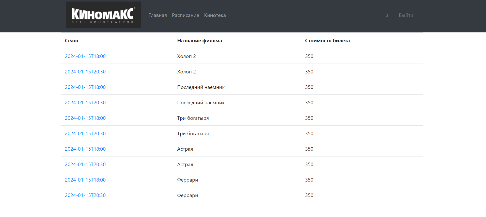

## Приложение кинотеатр.  

### Описание проекта.
Проект представляет собой сайт покупки билетов в кино.  
Права пользователей разделены:
- все пользователи могут просматривать информацию о сеансах;  
- только зарегистрированные пользователи могут приобрести билет на выбранный сеанс.  

### Стек технологий.
- Java 17  
- Spring Boot  
- Thymeleaf  
- Liquibase  
- Sql2o  
- PostgreSQL 15  
- Junit 5

### Требования к окружению.
Java 17    
Maven 3.8  
PostgreSQL 15  

### Запуск проекта.
Скачать проект с репозитория  
Создать базу данных cinema  
Выполнить команду liquibase:update для создания таблиц  
Запустить приложение src\main\java\ru\job4j\todo\Main  
Адрес доступа localhost:8080  

### Взаимодействие с приложением:
1. Регистрация

2. Ввод логина и пароля

3. Список всех фильмов

4. Информация о фильме

5. Список сеансов

6. Страница покупки билета

